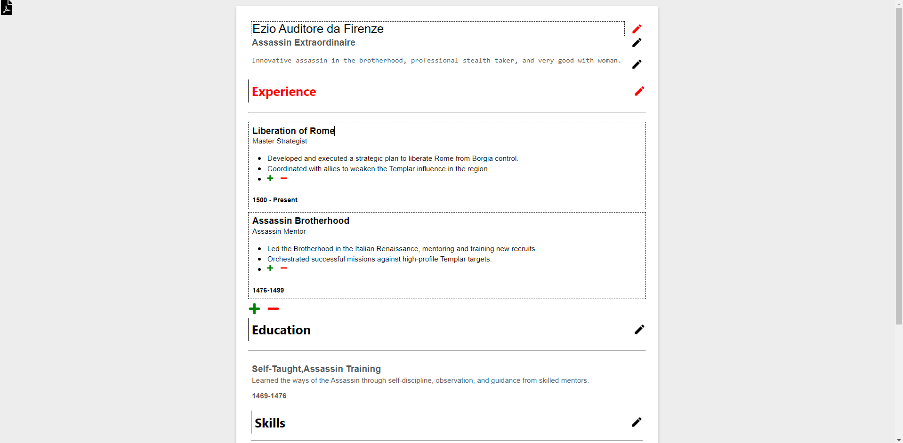

# resume-builder

A web application for creating and managing professional resumes, built using React and TypeScript.



## Table of Contents

- [Introduction](#introduction)
- [Features](#features)
- [Prerequisites](#prerequisites)
- [Getting Started](#getting-started)
- [Usage](#usage)
- [Default Demo JSON File](#Default-Demo-JSON-File)
- [Dependencies](#dependencies)

## Introduction

The Resume Builder is a project aimed at simplifying the process of creating and maintaining professional resumes. It provides an intuitive user interface for users to input their personal and professional information and generates a well-formatted resume.

## Features

- **User-friendly Interface**: Intuitive and easy-to-use interface for creating and editing resumes.
- **Real-time Preview**: Instantly preview changes to the resume as you input information.
- **Export Options**: Download the resume as PDF.
- **Responsive Design**: Ensures a seamless experience across different devices and screen sizes.
- **React + TypeScript**: Built using the React library with TypeScript for enhanced code quality and maintainability.

## Prerequisites

Before you begin, ensure you have met the following requirements:

- Node.js and npm installed on your machine.

## Getting Started

1. Clone the repository:

   ```bash
   git clone https://github.com/your-username/resume-builder.git

   ```

2. Navigate to the project directory:

   ```bash
   cd resume-builder

   ```

3. Install dependencies:

   ```bash
   npm install

   ```

4. Start the development server:

   ```bash
   npm start

   ```

5. Open your browser and visit [http://localhost:3000](http://localhost:3000) to view the application.

## Usage

1. Launch the application by following the "Getting Started" instructions.
2. Input your personal and professional information in the respective sections.
3. Preview your resume in real-time.
4. Download the resume as PDF.

### Default Demo JSON File

The project includes a default demo JSON file (`demoResume.json`) that you can use to quickly populate the resume fields for testing and exploration. You can import this file within the application to see how the resume builder works with sample data.

## Dependencies

- React
- TypeScript
- html2canvas
- react-icons
